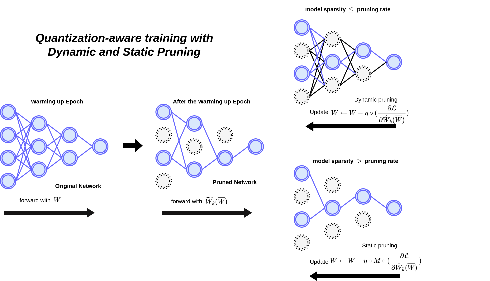

# [IEEE Access 2025][Quantization-aware training with Dynamic and Static Pruning](https://ieeexplore.ieee.org/document/10946020)

This repository provides the code for the IEEE Access 2025 paper titled Quantization-aware training with Dynamic and Static Pruning (QADS) by S. An, J. Shin, and J. Kim,.





## Train

CIFAR Train

``` CIFAR train
python cifar_train.py <choices=cifar10, cifar100>  --datapath ~/data -a resnet --layers <choices=32,56> -C -g 0 --save save_path.pth -P --prune-type unstructured --method ours_freeze --prune-freq 8 --prune-rate 0.9 --prune-imp L2 --epochs 163 --batch-size 128  --lr 0.2 --wd 1e-4 --nesterov --scheduler multistep --milestones 80 123  --gamma 0.1 --target_epoch 123 --cu_num 3 --n_bits <choices=2,3,4,6> --acti_quan <choices=0,1> --acti_n_bits <choices=2,3,4,6> --txt_name_test test_accuracy_path.txt --txt_name_train train_accuracy_path.txt > log_path.txt

```
SPEECH Train

``` SPEECH train
python speech_train.py audio --datapath ~/data -a resnet --layers 32 -C -g 0 --save save_path.pth -P --prune-type unstructured --method ours_freeze --prune-freq 8 --prune-rate 0.9 --prune-imp L2 --epochs 200 --batch-size 128  --lr 0.05 --wd 1e-4 --nesterov --scheduler step --step-size 30  --gamma 0.1 --target_epoch 123 --cu_num 2 --n_bits <choices=2,3,4,6> --acti_quan <choices=0,1> --acti_n_bits <choices=2,3,4,6> --txt_name_test test_accuracy_path.txt --txt_name_train train_accuracy_path.txt > log_path.txt
```
